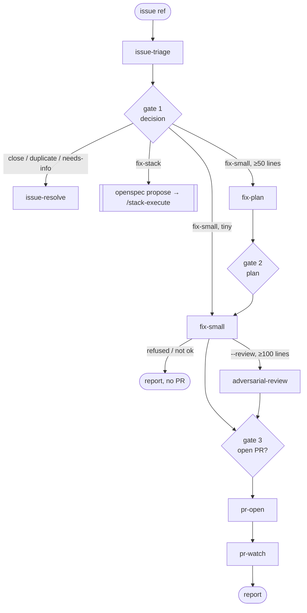
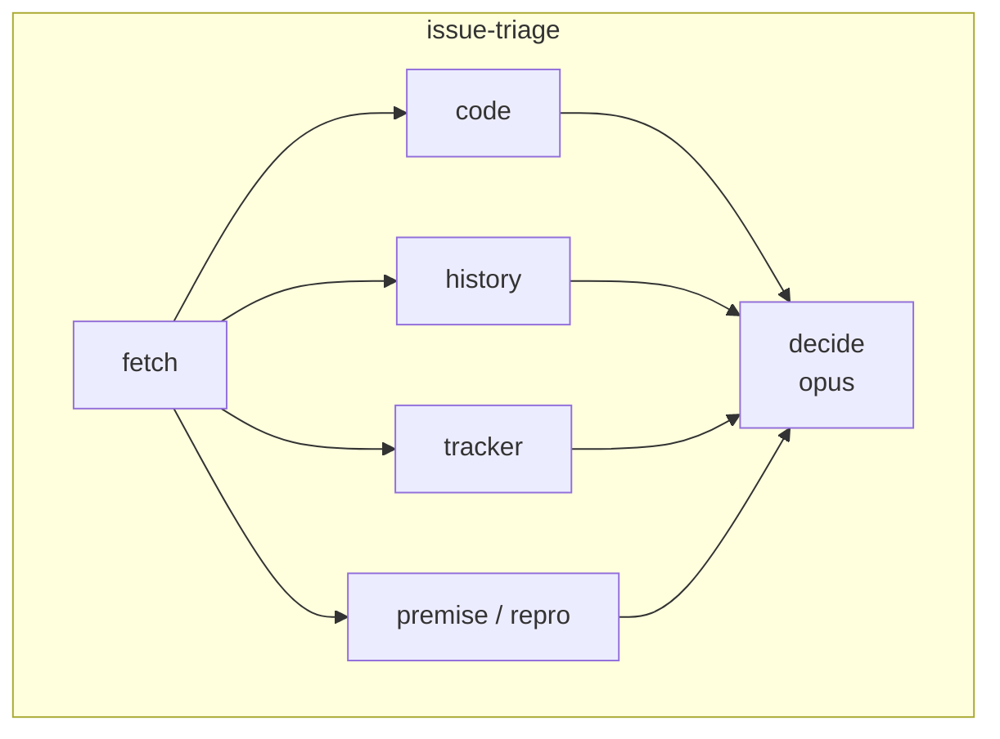
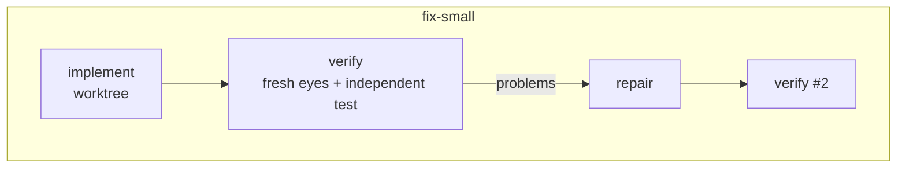
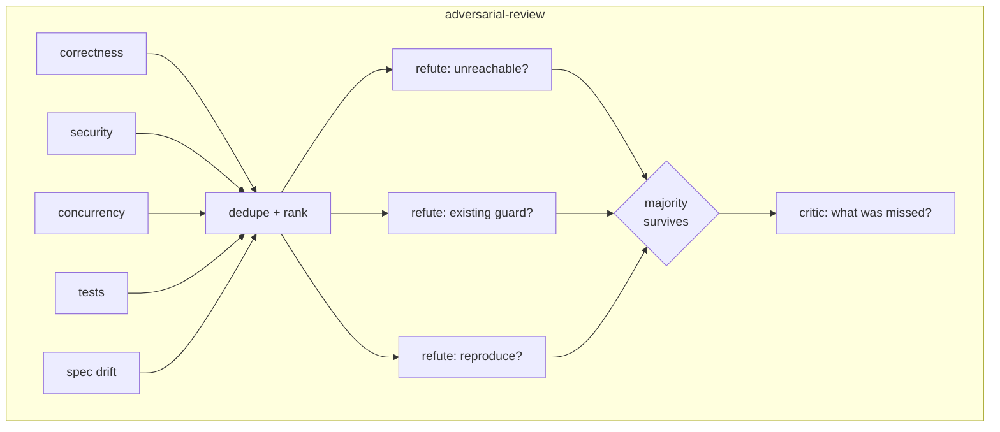
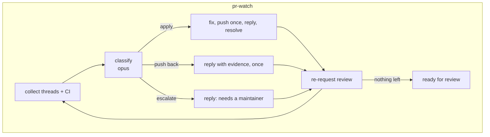

# claude-plugins

Cedric Ziel's [Claude Code](https://docs.claude.com/en/docs/claude-code) plugin marketplace.

## Install

```
/plugin marketplace add cedricziel/claude-plugins
/plugin install toolkit@cedricziel
```

## Plugins

### common

Shared building blocks used by `toolkit` (and installable on its own). `toolkit`
declares it as a plugin dependency, so `/plugin install toolkit@cedricziel` pulls
it in automatically.

**Skills** (loaded automatically when relevant)

| Skill | Purpose |
|---|---|
| `unslop` | Strips AI-slop tells (filler openers, false-emphasis, marketing words, decorative em dashes) from user-facing prose: docs, PR/issue descriptions, commit bodies, comments |

**Hooks**

| Event | What it does |
|---|---|
| `PostToolUse` (Edit/Write) | Auto-formats the edited file (cargo fmt/rustfmt, goimports/gofmt, swiftformat/swift-format, dart, ruff/black, prettier) — fail-open |

### toolkit

Everything I use day to day, in one plugin — including my global working rules, so a fresh machine only needs the plugin, not a synced `~/.claude/CLAUDE.md`. `instructions/fleet-brief.md` is the checklist handed to code-committing subagents. Depends on `common@cedricziel`.

**Skills** (loaded automatically when relevant)

| Skill | Purpose |
|---|---|
| `commit-discipline` | Atomic semantic commits, small always-shippable PRs |
| `git-stacked-prs` | Split large changes into a stack of reviewable PRs |
| `writing-tests` | Test-writing principles from the TDD canon |
| `adversarial-review` | `/adversarial-review [PR\|branch]` — runs the multi-agent workflow below |
| `issue-run` | `/issue-run <ref> [--review] [--no-watch] [--yes]` — sequences the issue workflows below with human gates between them |
| `coderabbit` | Working with CodeRabbit reviews on PRs |
| `forgejo-cli` | Using `fj` against Forgejo/Codeberg instances |
| `signaldb-observe` | Instrument an app with OpenTelemetry and ship to SignalDB |
| `dashboarding` | Designing and reviewing operational dashboards |

**Hooks**

| Event | What it does |
|---|---|
| `SessionStart` | Injects `instructions/global.md` (working rules + Caveman Compression) as context; re-injected after compaction. Disable with `TOOLKIT_INSTRUCTIONS_DISABLE=1` |
| `PostToolUse` (Edit/Write) | Nudges when source changes come without test changes |
| `Stop` | Blocks finishing while the project's test suite is red (fails open on environment errors) |
| `UserPromptSubmit` | Reminds to rebase when the branch has fallen behind the default branch |

Knobs and off-switches are documented in the headers of `plugins/toolkit/scripts/*.sh`.
Disable per repo with `.no-rebase-nudge` / `.no-format-hook`; override the test command with `.tdd-test-cmd`.

**Workflows**

Composable leaves; `/issue-run` sequences them and stops for approval at every gate. Judgment steps run on `opus`, mechanical steps on `sonnet`. Every leaf returns `refused: null` on success or a reason string for any early exit (budget floor, too small, unreproduced bug).



| Workflow | Question it answers | Agents |
|---|---|---|
| `issue-triage` | Is this issue real? Fetch, verify claims against HEAD (code, history, tracker, repro test in a worktree), size, propose a decision. No outward actions. | 6 |
| `issue-resolve` | Apply a non-fix decision: comment, label, close / mark duplicate. | 1 |
| `fix-plan` | What exactly changes? Files, the failing test, steps, risks, out-of-scope; a planning critic objects once. Refuses to shrink a stack into a PR. | 2–3 |
| `fix-small` | Does the fix work? Worktree, TDD from the repro test, lint, simplify, semantic commits; a fresh-eyes verifier writes an independent test from the issue text and checks for test-gaming; one repair round. Refuses unreproduced bugs. | 2–4 |
| `adversarial-review` | Does it survive attack? 5 lenses → 3 refuters per finding (distinct angles) → majority survives → critic names gaps. Skipped under 100 lines. | ~31 |
| `pr-open` | Is CI green? Draft PR with problem / approach / tests / risk / where to look, `Closes #N`; watch the newest run; fix a lint-only red once. | 2–4 |
| `pr-watch` | Are reviewers satisfied? Per round: collect new threads → classify apply / push back once / escalate → one push, replies, resolves, re-request. Marks ready when nothing is left. Never merges. | 3/round, ≤3 rounds |









Design rules are in `CLAUDE.md`; the evidence behind them (reproduce first, plan on the strong model, refute findings, independent verification, bounded rounds, draft-first PRs) is summarised in `docs/superpowers/specs/2026-08-28-issue-workflow-research.md`.

**Commands**

`/issue-create <context>`, `/pr-review <number>`. (`/issue` was replaced by `/issue-run`.)

## Development

```
python3 -m unittest discover -s tests
python3 scripts/validate.py
claude --plugin-dir plugins/toolkit   # local smoke test
```

## License

MIT
