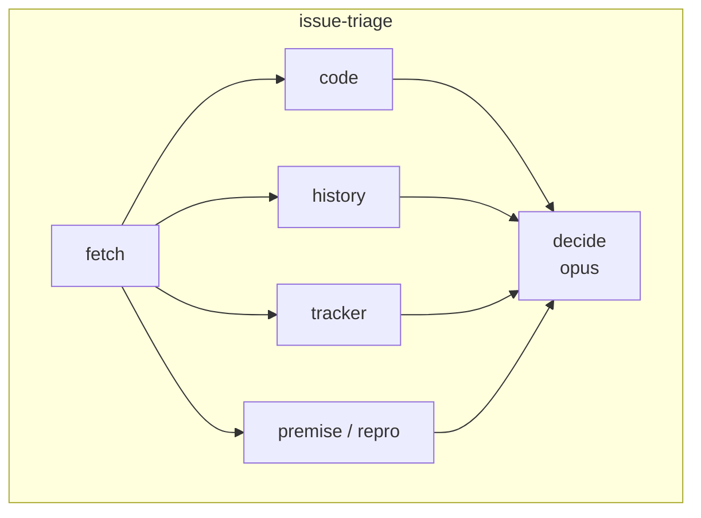
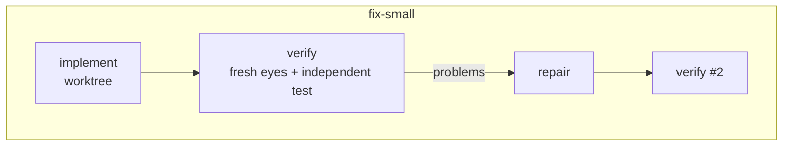
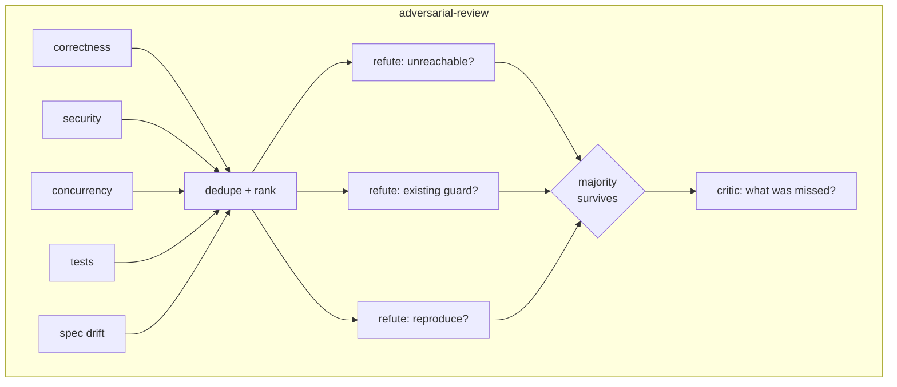
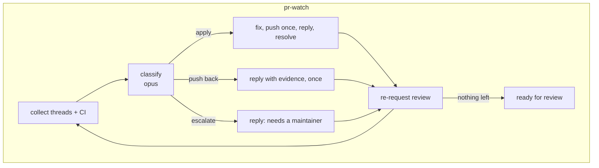

# claude-plugins

Cedric Ziel's [Claude Code](https://docs.claude.com/en/docs/claude-code) plugin marketplace.

## Install

```
/plugin marketplace add cedricziel/claude-plugins
/plugin install toolkit@cedricziel   # everything, personal use
/plugin install oss@cedricziel       # generic practice only, for any repo (day job, OSS, ...)
/plugin install skills@cedricziel    # generic tool-integration skills only (CodeRabbit, Forgejo, dashboards)
```

## Plugins

Four plugins, layered by audience — `common` → (`oss` and `skills`) → `toolkit` —
each depending on the ones before it, so installing a later plugin pulls in the
earlier ones automatically:

- **`common`** — universal hygiene with no assumptions about the repo, host, or
  employer.
- **`oss`** — generic engineering practice reusable in any repo, whether it's an
  OSS project or a private one (day job included).
- **`skills`** — generic tool-integration skills reusable by anyone who uses that
  tool: CodeRabbit, the Forgejo CLI, and dashboard design/review.
- **`toolkit`** — my personal layer: global working instructions, SignalDB
  observability, and the GitHub issue/PR orchestration engine.

### common

Shared building blocks used by `oss` and `toolkit` (and installable on its own).

**Skills** (loaded automatically when relevant)

| Skill           | Purpose                                                                                                                    |
| --------------- | -------------------------------------------------------------------------------------------------------------------------- |
| `unslop`        | Strip AI tells from prose and add voice — vendored from [pstack](https://github.com/cursor/plugins/tree/main/pstack) (MIT) |
| `code-comments` | When a code comment earns its place; referenced from `instructions/global.md` below                                        |
| `test-strategy` | What deserves a test, what kind (unit/integration/e2e), and when; referenced from `instructions/global.md` below           |

**Hooks**

| Event                      | What it does                                                                                                                                                                                                                                                                                |
| -------------------------- | ------------------------------------------------------------------------------------------------------------------------------------------------------------------------------------------------------------------------------------------------------------------------------------------- |
| `PostToolUse` (Edit/Write) | Auto-formats the edited file (cargo fmt/rustfmt, goimports/gofmt, swiftformat/swift-format, dart, ruff/black, prettier) — fail-open                                                                                                                                                         |
| `SessionStart`             | Injects `instructions/global.md` (delegation models, output style, semantic commits, stacked PRs under 500 lines, TDD + lint + `/simplify` before commit, default-no-comment, test-strategy pointer) as context; re-injected after compaction. Disable with `COMMON_INSTRUCTIONS_DISABLE=1` |

### oss

Generic engineering practice, reusable in any repo — OSS or private, day job
included. Depends on `common@cedricziel`. Meant to be depended on directly by
other repos' own plugins, not just installed by me.

**Skills** (loaded automatically when relevant)

| Skill               | Purpose                                                                                                                                                        |
| -------------------- | --------------------------------------------------------------------------------------------------------------------------------------------------------------- |
| `commit-discipline`  | Atomic semantic commits, small always-shippable PRs                                                                                                             |
| `git-stacked-prs`    | Split large changes into a stack of reviewable PRs                                                                                                              |
| `writing-tests`      | Test-writing principles from the TDD canon                                                                                                                      |
| `issue-create`       | `/issue-create <context>` — draft and file a well-structured GitHub issue from context                                                                          |
| `no-comments`        | `/oss:no-comments` — spawns the `comment-sicko` agent to purge narration comments and suppressions, then fixes the root causes — vendored from pstack (MIT)     |
| `technical-writing`  | `/oss:technical-writing` — Diátaxis + Google style + STE + Global English standard for docs, RFCs, READMEs, PR descriptions — vendored from pstack (MIT)        |
| `release-notes`      | Draft informative, non-bloated, user-value-focused release notes for a GitHub release: output shape, include/omit rules, input gathering with `gh`, grounding and unslop gates |

**Agents**

| Agent     | Purpose                                                                                                                                                            |
| --------- | ------------------------------------------------------------------------------------------------------------------------------------------------------------------- |
| `oss:coder`   | Scoped implementation engineer for any repo/language — failing test first, targeted builds, `/simplify` pass, semantic commit; delegate a planned task to it directly |
| `oss:comment-sicko` | Purges narration comments and suppressions; spawned by `no-comments` above — vendored from pstack (MIT)                                               |

### skills

Generic tool-integration skills, reusable by anyone who uses that tool —
not personal, not part of the orchestration engine. Depends on
`common@cedricziel` and `coderabbit@claude-plugins-official`.

**Skills** (loaded automatically when relevant)

| Skill          | Purpose                                                     |
| -------------- | ------------------------------------------------------------ |
| `coderabbit`   | Working with CodeRabbit reviews on PRs                       |
| `forgejo-cli`  | Using `fj` against Forgejo/Codeberg instances                |
| `dashboarding` | Designing and reviewing operational dashboards                |

### toolkit

My personal layer on top of `oss` and `skills`: global working instructions,
SignalDB observability, and the GitHub issue/PR orchestration engine — so a
fresh machine only needs this plugin, not a synced `~/.claude/CLAUDE.md`.
`instructions/fleet-brief.md` is the checklist handed to code-committing
subagents. Depends on `common@cedricziel`, `oss@cedricziel`, and
`skills@cedricziel`.

**Skills** (loaded automatically when relevant)

| Skill                | Purpose                                                                                                                                                                     |
| -------------------- | ---------------------------------------------------------------------------------------------------------------------------------------------------------------------------- |
| `adversarial-review` | `/adversarial-review [PR\|branch]` — runs the multi-agent workflow below                                                                                                    |
| `deep-review`        | `/deep-review [PR\|branch]` — categorized review with severities, nitpicks and committable suggestions; report only, never touches GitHub                                  |
| `pr-review`          | `/pr-review <PR>` — the same engine, then submits one real GitHub review (decision, summary, inline suggestions)                                                            |
| `issue-run`          | `/issue-run <ref> [--review] [--no-watch] [--yes]` — sequences the issue workflows below with human gates between them                                                     |
| `signaldb-observe`   | Instrument an app with OpenTelemetry and ship to SignalDB                                                                                                                   |

**Hooks**

| Event                      | What it does                                                                                                                                                   |
| -------------------------- | -------------------------------------------------------------------------------------------------------------------------------------------------------------- |
| `SessionStart`             | Injects `instructions/global.md` (working rules + Caveman Compression) as context; re-injected after compaction. Disable with `TOOLKIT_INSTRUCTIONS_DISABLE=1` |
| `PostToolUse` (Edit/Write) | Nudges when source changes come without test changes                                                                                                           |
| `Stop`                     | Blocks finishing while the project's test suite is red (fails open on environment errors)                                                                      |
| `UserPromptSubmit`         | Reminds to rebase when the branch has fallen behind the default branch                                                                                         |

Knobs and off-switches are documented in the headers of `plugins/{common,toolkit}/scripts/*.sh`.
Disable per repo with `.no-rebase-nudge` / `.no-format-hook`; override the test command with `.tdd-test-cmd`.

**Workflows**

Composable leaves; `/issue-run` sequences them and stops for approval at every gate. Judgment steps run on `opus`, mechanical steps on `sonnet`. Every leaf returns `refused: null` on success or a reason string for any early exit (budget floor, too small, unreproduced bug).


| Workflow             | Question it answers                                                                                                                                                                                                                   | Agents             |
| -------------------- | ------------------------------------------------------------------------------------------------------------------------------------------------------------------------------------------------------------------------------------- | ------------------ |
| `issue-triage`       | Is this issue real? Fetch, verify claims against HEAD (code, history, tracker, repro test in a worktree), size, propose a decision. No outward actions.                                                                               | 6                  |
| `issue-resolve`      | Apply a non-fix decision: comment, label, close / mark duplicate.                                                                                                                                                                     | 1                  |
| `fix-plan`           | What exactly changes? Files, the failing test, steps, risks, out-of-scope; a planning critic objects once. Refuses to shrink a stack into a PR.                                                                                       | 2–3                |
| `fix-small`          | Does the fix work? Worktree, TDD from the repro test, lint, simplify, semantic commits; a fresh-eyes verifier writes an independent test from the issue text and checks for test-gaming; one repair round. Refuses unreproduced bugs. | 2–4                |
| `adversarial-review` | Does it survive attack? 5 lenses → 3 refuters per finding (distinct angles) → majority survives → critic names gaps. Skipped under 100 lines.                                                                                         | ~31                |
| `code-review`        | What is wrong, and what would fix it? Nests `adversarial-review`, adds style nitpicks, a single-line committable suggestion per finding where one is safe, a severity-driven decision and a summary. Posts nothing.                   | ~35–40             |
| `pr-review-submit`   | Post the verdict: one atomic GitHub review — decision, summary, inline comments. Falls back to a comment-free review if GitHub rejects the line anchors, so the verdict survives.                                                     | 1                  |
| `pr-open`            | Is CI green? Draft PR with problem / approach / tests / risk / where to look, `Closes #N`; watch the newest run; fix a lint-only red once.                                                                                            | 2–4                |
| `pr-watch`           | Are reviewers satisfied? Per round: collect new threads → classify apply / push back once / escalate → one push, replies, resolves, re-request. Marks ready when nothing is left. Never merges.                                       | 3/round, ≤3 rounds |









Design rules are in `CLAUDE.md`; the evidence behind them (reproduce first, plan on the strong model, refute findings, independent verification, bounded rounds, draft-first PRs) is summarised in `docs/superpowers/specs/2026-08-28-issue-workflow-research.md`.

toolkit no longer has any freeform commands — `/issue` was replaced by `/issue-run`,
and the freeform `/pr-review` and `/issue-create` commands by the `pr-review`
(toolkit) and `issue-create` (oss) skills above.

## Development

```
python3 -m unittest discover -s tests
python3 scripts/validate.py
claude --plugin-dir plugins/toolkit   # local smoke test
```

## License

MIT. `common`'s `skills/unslop` and `oss`'s `skills/no-comments`, `skills/technical-writing` and `agents/comment-sicko` are vendored from pstack (© Lauren Tan, MIT — see its `LICENSE`).
